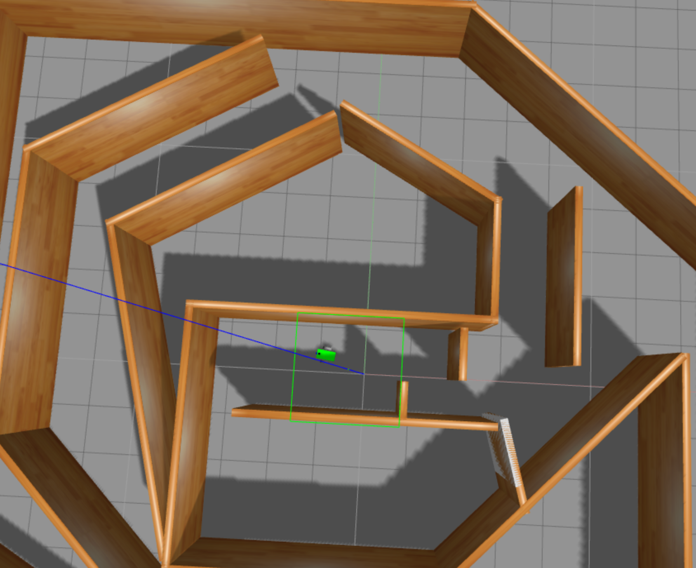
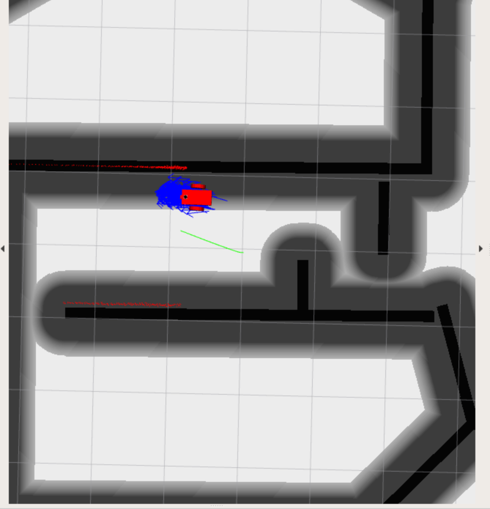

 # Ball Chaser

## Launching the project:

### first terminal:
`roscore`

### second terminal:
`source devel/setup.bash`
`roslaunch my_robot world.launch`

### third terminal:
`source devel/setup.bash`
`roslaunch my_robot amcl.launch`

