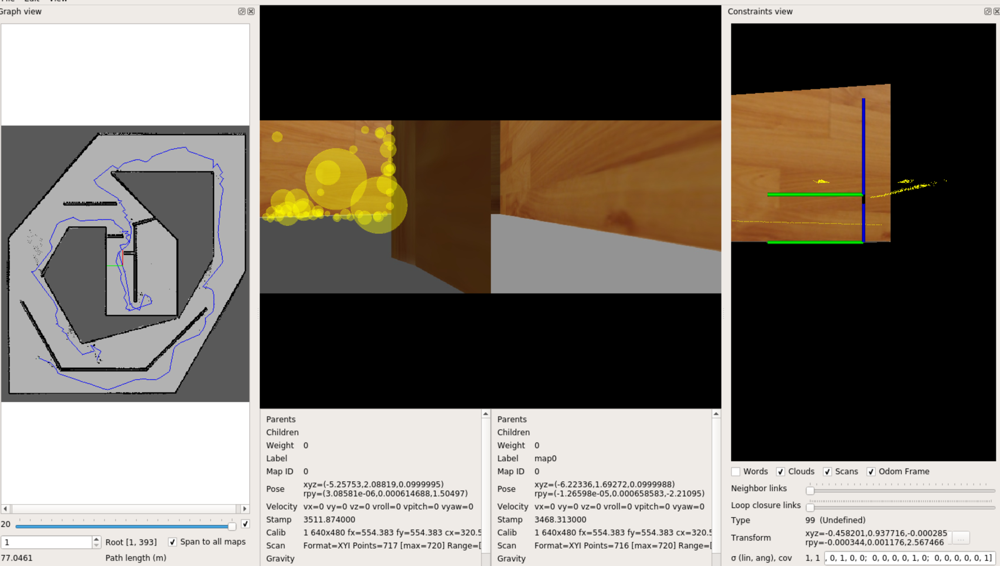
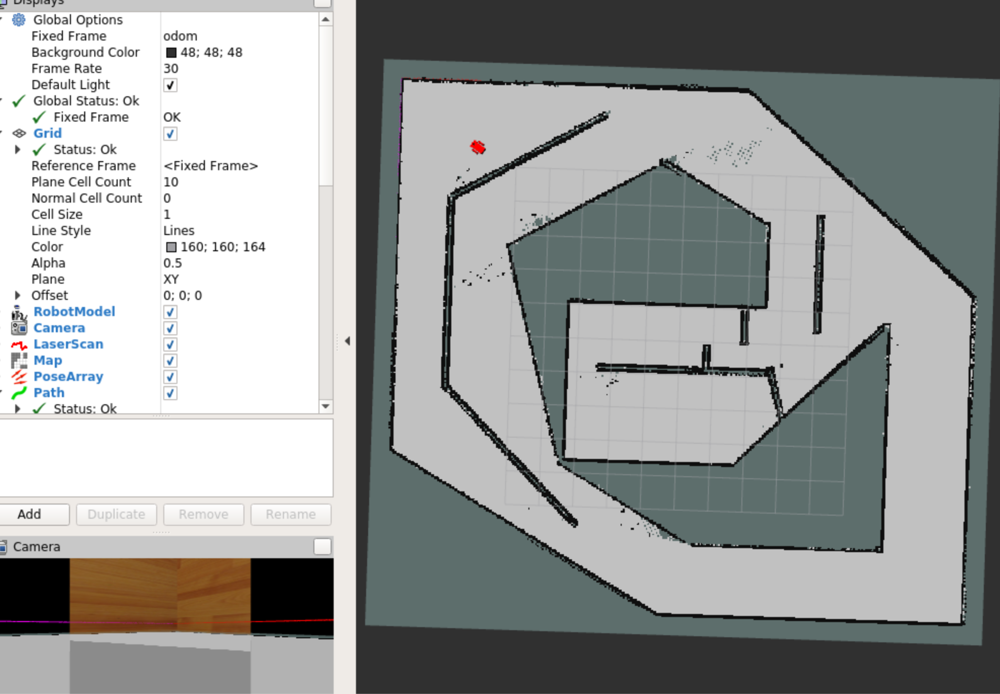

 # May My World

An example application of the RTAB-Map SLAM algorithm in ROS.
Using a kinect camera and a robot to map the environment.
The robot is controlled by the keyboard.

## Prerequisites:
- ROS Kinetic

## Launching the project:

### first terminal:
`roscore`

### second terminal:
`source devel/setup.bash`
`roslaunch my_robot world.launch`

### third terminal:
`source devel/setup.bash`
`rosrun teleop_twist_keyboard teleop_twist_keyboard.py`

### fourth terminal:
`source devel/setup.bash`
`roslaunch my_robot mapping.launch`
*
## Viewing the map (database):
`source devel/setup.bash`
`rtabmap-databaseViewer <database>/rtabmap.db`

link to the database:
https://drive.google.com/file/d/1FDt1jVUdISkgqrKRUEMaiyjdITgERtqs/view?usp=share_link